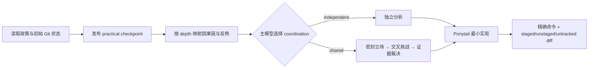

# Wide-Lens Engineering

面向 Codex 的软件工程 Skill：日常编码走低开销 `practical`，高风险或需要审计的交付走外部锚定 `assured`。两条路径共享系统映射、反例、根因定位、Ponytail 最小实现和可选多代理讨论，但明确区分“流程纪律”与“独立可信证明”。

它服务于功能实现、调试、重构、迁移、架构修改和代码审查，不再把所有编码任务强制送入同一套高保证手续。

## 核心设计

每次任务分别选择三个轴：

| 轴 | 选项 | 决定什么 |
|---|---|---|
| assurance | `practical` / `assured` | 需要普通工程证据，还是外部 controller、digest、packet 和 gate |
| depth | `focused` / `full` | 分析短因果链，还是跨模块与多风险 lens |
| coordination | `independent` / `shared` | 独立分析，还是密封立场、交叉挑战与证据裁决 |

三个选择互不代替。`full` 不自动等于 assured，`assured` 不自动要求 shared。

为保持 v4 wire 兼容：

- `assured + focused` 只有在低风险、independent 且不会隐藏触发 lens 时映射为 v4 `profile=light`；
- 其他 assured focused 组合公开提升为 v4 `profile=full`；
- `assured + full` 始终映射为 v4 `profile=full`；
- v4 contract、packet、receipt 和 report 不增加 `assurance` 或 `depth` 字段。

## 什么时候使用 practical

只有以下条件全部成立时使用 practical：

- 局部、可回滚、没有仓库外副作用；
- 编辑前能明确目标、允许路径和精确验收命令；
- 不涉及安全、权限、凭据、隐私、合规、持久化数据、schema 迁移、删除恢复、并发一致性、公共 API、部署或基础设施；
- 用户没有要求不可变合同、外部证明、审计或 attestation。

Practical 不生成 baseline manifest、authority grants、packet、digest、receipt 或 attestation。它依靠用户可见 checkpoint、精确测试和实际 Git diff 防止普通的范围漂移与虚报完成。



Practical checkpoint 至少包含：

```text
assurance: practical
intent: change | debug | review
depth: focused | full
coordination: independent | shared
objective: ...
non-goals: ...
allowed paths: ...
exact acceptance commands: ...
assumptions: ...
pre-existing dirty paths: ...
```

目标、范围、验收或安全边界需要改变时，必须在继续编辑前公开修订并取得用户批准，不能在最终报告中偷偷改写。

最终验证至少检查：

```bash
git diff --check
git diff --cached --check
git status --porcelain=v2 -z --untracked-files=all
git diff --no-ext-diff --
git diff --cached --no-ext-diff --
```

完整步骤见 [references/practical.md](references/practical.md)。

## 什么时候强制 assured

出现任一条件即升级 assured：

- 安全、认证、授权、密钥、凭据、隐私或合规；
- 数据/schema 迁移、删除、恢复、持久化兼容；
- 并发、分布式一致性、公共 API/协议；
- 部署、发布、基础设施、不可逆或仓库外副作用；
- 验收需要网络、凭据或仓库外写入；
- 跨服务/仓库、实质性 checkpoint 修订、高影响不确定性或 unresolved contradiction；
- 用户明确要求 immutable contract、controller observation、audit、attestation 或 high assurance。

Assured 使用现有 protocol v4，不降低任何检查：

1. 外部 baseline v2；
2. 完整 authority contract 和逐项 grants；
3. 确定性 packet v4 与独立 digest；
4. `shared` 时必需的 runtime receipt（`independent` 不使用）；
5. pinned verifier preflight；
6. 冻结验收命令；
7. controller 观察的最终状态与 diff digest。

规范见 [references/protocol.md](references/protocol.md)。如果 controller、独立 digest channel、pinned verifier、artifact isolation 或 OS sandbox 不存在，应报告 assured 条件不成立，不能静默降级或伪造锚点。

## Shared subagents

是否使用 subagent，以及身份、数量和 lane assignments，始终只由当前主模型根据边际信息价值、风险、因果宽度、可用并发、延迟和成本决定。

Skill 不包含 exact/default/max participant count，也不提供“按预算计算人数”的算法。Shared 的 `>=2` 只是讨论的语义下界。

用户、controller 或 runtime 可以提供 aggregate deadline、token、cost 或 tool-call envelope；主模型在其中自行选择参与者并在证据覆盖完成时停止。

共同规则：

- subagent 只读；
- 禁止递归委派；
- 主线程唯一写入和集成；
- Round 1 先密封独立立场；
- 所有人接收同一 peer board；
- Round 2 必须挑战或证伪其他立场；
- 最终按判别性证据裁决，不投票。

Practical shared 的讨论记录只是 Agent evidence；assured shared 仍要求外部 controller receipt。

## Ponytail 收敛

理解完整因果链后，从上到下停在第一个能工作的层级：

```text
not-needed → reuse → stdlib → native → existing-dependency → minimal-custom
```

不增加推测性抽象、依赖、配置或脚手架。不得简化掉安全边界、数据保护、必要错误路径、可访问性、明确验收或最小有用回归测试。

## 信任边界

| 能力 | practical | assured v4 + 真实外部基础设施 |
|---|---:|---:|
| 用户可见目标/范围/验收 checkpoint | 是 | 是，完整进入 packet |
| 实际 Git diff 与精确命令复核 | 是 | 是，controller 重新观察 |
| 防止 report 新增验收命令 | 流程约束 | gate 强制 |
| 独立 packet/verifier/receipt digest | 否 | 是 |
| authority 与 controller 身份认证 | 否 | 仅在外部认证/签名时 |
| 限制仓库外写入、网络、凭据、后台进程 | 否 | 需要外部 OS sandbox |
| 排除 swap-and-restore、全部 ACL/owner/xattr 变化 | 否 | 仍不能完全保证 |
| 真实世界 100% 正确或缺陷召回 | 否 | 否 |

同一未受信会话打印的摘要不是独立认证。哈希能证明内容一致性，不能独自证明来源、时序或身份。

## Worktree 与链接

Assured v4 继续 fail closed：拒绝外置 `.git` gitfile、symlink、junction 和 reparse point，因为这些对象可能把受观察状态移出可信根。

Practical 可以在 Git worktree 中工作，但外置 Git 元数据不属于其保证。任何计划写路径或父路径是 symlink/junction/reparse point 时，必须停止并取得适合该可信根模型的明确授权。

## 安装

要求 Python 3.10+、Git 和 Codex；运行时无第三方 Python 依赖。

```bash
git clone https://github.com/Mai-xiyu/wide-lens-engineering.git \
  "${CODEX_HOME:-$HOME/.codex}/skills/wide-lens-engineering"
```

PowerShell：

```powershell
$skillRoot = if ($env:CODEX_HOME) { Join-Path $env:CODEX_HOME 'skills' } else { Join-Path $HOME '.codex\skills' }
git clone https://github.com/Mai-xiyu/wide-lens-engineering.git (Join-Path $skillRoot 'wide-lens-engineering')
```

刷新 Skill 列表后使用 `$wide-lens-engineering`。

## 使用示例

普通局部编码：

```text
Use $wide-lens-engineering to fix this local parser bug.
Choose assurance, depth, and coordination independently.
```

高保证交付：

```text
Use $wide-lens-engineering in assured mode for this authorization migration.
Do not proceed unless the external controller, anchors, verifier, and sandbox are real.
```

需要多代理讨论：

```text
Use $wide-lens-engineering and let the active main model decide whether shared subagents add value,
including their identities, count, and lane assignments.
```

## 仓库结构

```text
wide-lens-engineering/
├── SKILL.md
├── README.md
├── agents/
│   └── openai.yaml
├── references/
│   ├── practical.md
│   ├── protocol.md
│   └── lenses.json
├── scripts/
│   ├── diverge.py
│   └── check_delivery.py
└── tests/
    ├── eval_cases.json
    ├── run_eval.py
    └── run_forward_eval.py
```

根目录就是 Skill 根，不嵌套同名目录。

## 测试与度量

```bash
python -B tests/run_eval.py --threshold 1.0 --json
python -B tests/run_forward_eval.py --threshold 1.0 --require-no-skips --json
```

本次加入 6 个静态路由契约回归后，release suite 应为 `197 + 76 = 273` 个 oracle，要求 `273/273`、阈值 `1.0`、`skipped=0`。其中路由项验证规范文本、UI 元数据和 v4 黄金摘要，不调用模型；该比例不代表模型路由准确率、模型能力或真实项目缺陷召回率。模型行为需另做独立 fresh-agent 场景评测。

Practical 不执行强制全仓内容哈希；主要成本来自目标映射、相关测试和 Git diff。Assured 的 baseline 与 gate 共执行三个稳定快照，即六个完整扫描 pass，每个 pass 时间复杂度为 `O(F + B + S)`。

## 设计依据

- [OpenAI Codex customization](https://developers.openai.com/codex/concepts/customization)：Skills 的渐进披露、可复用工作流、scripts/references 与 subagents 分工。
- [OpenAI Codex use cases](https://developers.openai.com/codex/use-cases)：将重复工作流保存为 Skill。
- [SLSA attestation model](https://slsa.dev/spec/v1.2/attestation-model) 与 [in-toto](https://in-toto.io/)：外部 subject/digest、签名 envelope 与供应链证明。
- [Microsoft FindFirstStreamW](https://learn.microsoft.com/en-us/windows/win32/api/fileapi/nf-fileapi-findfirststreamw)、[GetLongPathNameW](https://learn.microsoft.com/en-us/windows/win32/api/fileapi/nf-fileapi-getlongpathnamew) 和 [Windows naming rules](https://learn.microsoft.com/en-us/windows/win32/fileio/naming-a-file)：ADS、8.3 alias 和 Win32 路径边界。

## Keywords

Codex Skill, OpenAI Codex, coding agent, practical coding workflow, assured software delivery, software engineering agent, code generation, feature implementation, debugging, root cause analysis, bug fixing, refactoring, migration, architecture, code review, multi-agent systems, shared subagents, runtime delegation, adaptive agent orchestration, immutable contract, authority grants, frozen acceptance criteria, external trust anchor, runtime receipt, controller attestation, evidence-gated delivery, adversarial testing, forced divergent thinking, Git diff verification, worktree, Ponytail, YAGNI, minimal implementation.
