# Wide-Lens Engineering

Evidence-gated Codex Skill for efficient end-to-end software engineering: understand the repository, choose the smallest correct solution, coordinate shared subagents, write code through one owner, and verify delivery.

面向完整软件工程任务的 Codex Skill：不再只做 review，而是覆盖功能实现、构建、调试、修复、重构、迁移、审查与交付。它先扩展视野，再用 Ponytail 式最小化策略收敛实现，最后以可执行证据验收。

## Operating modes

| Intent | Purpose | Writes code |
| --- | --- | --- |
| `change` | Features, builds, refactors, migrations, requested changes | Yes |
| `debug` | Reproduce, find the shared root cause, fix, add regression evidence | Yes |
| `review` | Read-only audit and evidence-backed findings | No |

Low-risk isolated work uses a light single-owner path without subagents. Medium/high-risk or cross-cutting work can use two or three analysis agents with sealed independent positions followed by shared peer challenge.

## Why this shape

Efficient coding needs both breadth and restraint:

- Repository mapping prevents a small patch in the wrong place.
- Independent agents find hidden consumers, invariants, failure paths, and counterexamples.
- A canonical shared board enables multi-agent discussion without majority voting.
- Ponytail pressure removes speculative abstractions, dependencies, and boilerplate.
- One editing owner avoids merge conflicts and inconsistent partial implementations.
- Acceptance commands and delivery records prevent a plausible-looking diff from being treated as completion.

## Workflow

```mermaid
flowchart LR
    A["Freeze intent and acceptance"] --> B["Map causal surface"]
    B --> C["Ponytail solution shaping"]
    C --> D["Sealed independent agents"]
    D --> E["Shared peer falsification"]
    E --> F["Evidence adjudication"]
    F --> G["Single-owner code change"]
    G --> H["Narrow-to-broad verification"]
    H --> I["Delivery consistency gate"]
```



Shared mode is bounded to two or three agents, two turns per agent, one retry total, ten minutes per round, and a 65,536-byte peer board. Analysis agents remain read-only; the main thread owns integration.

## Ponytail integration

When the optional `$ponytail` Skill is available, Wide-Lens Engineering invokes it during solution shaping. It is not a hard dependency. Without Ponytail, the same fallback ladder is applied directly:

1. Does this need to exist?
2. Can existing repository code be reused?
3. Can the standard library solve it?
4. Can a native platform feature solve it?
5. Can an already-installed dependency solve it?
6. Only then add the minimum custom code.

The ladder runs after repository comprehension. It never removes required security, validation, data integrity, error handling, accessibility, or regression checks.

## Install

The repository root is the Skill root and contains `SKILL.md` directly.

### Linux / macOS

```bash
git clone https://github.com/Mai-xiyu/wide-lens-engineering.git ~/.agents/skills/wide-lens-engineering
```

### Windows PowerShell

```powershell
git clone https://github.com/Mai-xiyu/wide-lens-engineering.git "$env:USERPROFILE\.agents\skills\wide-lens-engineering"
```

### Upgrade from the old name

Remove the old `wide-lens-review` Skill directory or junction, then install `wide-lens-engineering`. GitHub redirects the old repository URL after the rename, but the Codex invocation name changes to `$wide-lens-engineering`.

## Use

Implement a feature efficiently:

```text
Use $wide-lens-engineering to implement this feature. Use the light path if it is truly isolated; otherwise coordinate shared agents and keep one editing owner.
```

Debug and fix a cross-module failure:

```text
Use $wide-lens-engineering in debug mode. Reproduce the failure, trace sibling callers, fix the shared root cause, and leave a regression check.
```

Combine explicit Ponytail minimalism with shared agents:

```text
Use $wide-lens-engineering with $ponytail full to build this migration using three shared subagents. Resolve disagreements with executable evidence, not voting.
```

Run a read-only audit:

```text
Use $wide-lens-engineering in review mode. Do not edit files.
```

## CLI

Generate a light coding packet:

```bash
python scripts/diverge.py \
  --task "Implement tenant-aware export" \
  --intent change \
  --path src/export.py \
  --risk low \
  --profile light \
  --format json
```

Generate a shared debug packet:

```bash
python scripts/diverge.py \
  --task "Fix duplicate rows after retry" \
  --intent debug \
  --path src/store.py \
  --risk high \
  --coordination shared \
  --agents 3 \
  --format json
```

Validate a completed delivery record:

```bash
python scripts/check_delivery.py --packet packet.json --report report.json
```

Run the regression suite:

```bash
python -B tests/run_eval.py --json
```

The runtime scripts use only the Python standard library.

## Delivery contract

For `change` and `debug`, the final report records:

- Implementation status and one `main-thread` editing owner.
- Allowed and actually changed repository-relative paths.
- Authorized baseline, final-state, and diff references.
- Ponytail source, intensity, selected ladder rung, rejected complexity, and preserved safety.
- Acceptance criteria mapped to commands that also appear as passed top-level checks.
- Root-cause evidence and reproduction command for `debug`.

For `review`, `implementation` must be `null`.

The deterministic gate checks internal consistency. It deliberately does not execute commands from an untrusted report, inspect the repository, authenticate evidence, or prove agent isolation. Raw command output and tracked/untracked/ignored state manifests must be produced through the authorized main-thread tool path.

## Repository layout

```text
.
├── SKILL.md                 # Intent routing and engineering workflow
├── agents/
│   └── openai.yaml          # Codex UI metadata and default prompt
├── references/
│   ├── lenses.json          # Intent-aware deterministic lane catalog
│   └── protocol.md          # Evidence, implementation, and discussion schema
├── scripts/
│   ├── diverge.py           # Work-packet and shared-agent prompt generator
│   └── check_delivery.py    # Deterministic delivery consistency gate
└── tests/
    ├── eval_cases.json      # Selection, mutation, policy, and failure cases
    └── run_eval.py          # Test runner and real CLI subprocess oracles
```

## Validation scope

The fixed suite requires a 100% pass rate by default and refuses thresholds below 98%. It covers intent routing, light/full behavior, Ponytail activation, shared-agent assignments, canonical prompts, peer-board digests, implementation outcomes, root-cause records, edit-scope paths, acceptance mappings, malformed inputs, timeout/retry accounting, and real planner/gate CLI subprocesses.

That rate measures only the checked fixtures. It is not universal defect recall, model accuracy, or proof that self-reported evidence is genuine.

## Keywords

Codex Skill, OpenAI Codex, software engineering, coding agent, code generation, feature implementation, debugging, bug fixing, refactoring, migrations, multi-agent systems, shared subagents, agent orchestration, adversarial analysis, code review, repository audit, evidence-gated delivery, Ponytail, YAGNI, minimalism, forced divergent thinking, agentic coding workflow.
