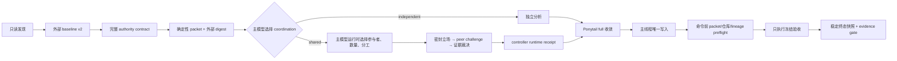

# Wide-Lens Engineering

面向 Codex 的端到端软件工程 Skill。它同时服务于写代码、调试、重构、迁移、架构修改和代码审查：先把完整任务合同冻结进外部锚定 packet，再由当前主模型自主决定是否使用 shared subagents、实际数量与分工；subagent 只读讨论，主线程唯一写入；最后由外部 controller 观测真实仓库状态并执行冻结验收。

项目刻意结合两种约束：Wide Lens 负责强制发散、反证和多代理讨论；Ponytail `full` 负责在理解完整问题后收敛到能工作的最小实现。

## 它修复什么

常见 Agent 工作流把任务解释、实现、验收范围和最终结论交给同一个可写主体，容易产生以下问题：

- 开始时声称“合同已冻结”，实际却没有完整进入不可变 packet；
- 结束时由同一个 Agent 重写 objective、scope、acceptance 或 baseline，再宣布完成；
- Skill 固定 subagent 数量，阻止当前主模型按任务风险和可用并发动态决策；
- 多代理只有摘要，没有密封独立立场、完整 peer board、交叉挑战和证据裁决；
- report 自报 changed paths、测试结果和 subagent 行为，缺少 controller 观测；
- 字符串路径检查遗漏 Windows 8.3 alias、ADS、junction、Unicode 大小写等语义；
- 为“全面”引入不必要的抽象和依赖，不能回落到最小实现。



## 核心保证

- 完整合同在实现和 delegation 前进入 packet；packet digest 必须通过目标仓库外的可信通道锚定。
- authority 不是标签。每个 normative item 都需要精确 `{target, item_sha256}` grant；缺失、过期、重复、未消费或不匹配的 grant 都失败。
- final report 不能重新声明 objective、scope、acceptance、baseline 或 authority，也不能增加可执行命令。
- `coordination` 在 packet 前由当前主模型选择。shared packet 锚定后，参与者 identity、实际数量和 lane assignments 仍由当前主模型决定。
- Skill、packet 和 runtime prompt 工具都不提供 exact/default/max subagent count。shared 的 `>=2` 只是“讨论”的语义下界，不是编排策略。
- subagent 只读、禁止递归委派；主线程始终是唯一 editing/integration owner。
- shared 需要仓库外 runtime receipt 及独立 digest；receipt 绑定运行时参与者、lane assignments 和完整 deliberation。
- baseline manifest v2 覆盖根目录对象 identity、`.git`、普通目录、空目录、文件内容、mode、Windows attributes、file identity、link count 和 NTFS named streams。根目录文件对象被同路径替换也会失败。
- 外置 `.git` gitfile、symlink、junction 和其他 reparse point fail closed；Windows scope 使用 invariant ordinal-style 映射，并拒绝真实 8.3 alias。
- gate 在任何验收命令前重建完整 derived packet、绑定 prior lineage、验证 verifier 外置、绑定仓库路径与根对象，并执行稳定的当前仓库预扫描。
- revision 必须提供外部 prior packet 和独立 prior digest；`contract_id` 必须相同，revision 必须严格等于 prior revision 加一。
- gate 只执行 frozen contract 中的命令。Windows shell 固定到系统 `cmd.exe`；相对/repository `PATH` 项和高风险语言/工具 hook 被隔离；所有继承的 `GIT_*` 变量先清除，再只设置受控 Git 配置。
- gate 在命令后重验所有 artifact/verifier 文件，采集稳定终态，输出实际 changed paths、exit code、stdout/stderr digest、`final_state_sha256` 和 `diff_sha256`。
- `diff_sha256` 绑定 `{repository_ref, baseline_state_sha256, final_state_sha256, changed_paths}`，不是仅对路径列表做摘要。
- Ponytail 固定为 `full`，按 `not-needed → reuse → stdlib → native → existing-dependency → minimal-custom` 收敛。

## 信任边界

| 能力 | 本项目能否独立保证 |
|---|---|
| packet、baseline、receipt、prior packet 与 verifier 的持久修改检测 | 能；通过外部 digest 与检查后逐文件重验 |
| 当前 packet 在执行命令前与确定性 planner 完全一致 | 能 |
| 当前目标仓库与 baseline 路径、根文件对象一致 | 能；在命令前检查 |
| report changed paths 与 controller 终态 diff 一致 | 能 |
| report 新增命令不会执行 | 能 |
| unsigned authority/receipt 的真实身份 | 不能；需要认证或签名 controller |
| subagent 的真实 OS 写入者身份 | 不能；需要 runtime/sandbox enforcement |
| artifact 被瞬时替换后恢复、并发目录换位等 TOCTOU | 不能完全排除；需要只读/不可变 artifact store 与 OS 级隔离 |
| 验收代码不写其他仓库、凭据目录或网络 | 不能；必须由外部 OS sandbox 限制 |
| timeout 后没有后台后代进程 | 不能；需要 job/process sandbox 和生命周期管理 |
| 真实世界正确性或 100% 缺陷召回 | 不能；测试通过率只描述固定 oracle |

同一次未受信运行打印的 `verifier_sha256` 不是独立认证。高保证部署应由 controller 在启动前校验只读 verifier bundle，并让 Agent 无权修改 verifier、外部 artifacts、digest channel、signing key 和 sandbox policy。

## 安装

要求 Python 3.10+、Git、Codex；运行时没有第三方 Python 依赖。Codex Skill 根目录是 `$CODEX_HOME/skills`；未设置时使用 `~/.codex/skills`。

```bash
git clone https://github.com/Mai-xiyu/wide-lens-engineering.git \
  "${CODEX_HOME:-$HOME/.codex}/skills/wide-lens-engineering"
```

PowerShell：

```powershell
$skillRoot = if ($env:CODEX_HOME) { Join-Path $env:CODEX_HOME 'skills' } else { Join-Path $HOME '.codex\skills' }
git clone https://github.com/Mai-xiyu/wide-lens-engineering.git (Join-Path $skillRoot 'wide-lens-engineering')
```

刷新 Codex Skill 列表后使用 `$wide-lens-engineering`。

## 快速使用

```text
Use $wide-lens-engineering to implement this feature end to end.
Let the active main model decide whether shared subagents help and how many to use.
Use Ponytail full, keep subagents read-only, and gate against external artifacts.
```

### 1. 捕获外部 baseline

baseline 文件必须尚不存在，且 artifact 目录必须位于目标仓库外：

```bash
python <trusted-skill>/scripts/check_delivery.py \
  --capture-baseline \
  --repo-root <canonical-target-repository> \
  --baseline-manifest <external-artifact-dir>/baseline.json
```

字段映射必须明确：

- 输出 `repository_ref` → 合同 `baseline.repository_ref`；
- 输出 `state_ref` → 合同 `baseline.state_ref`；
- 输出 `baseline_manifest_sha256` → 合同 `baseline.state_sha256`。

输出中的 `verifier_sha256` 是 bundle 摘要候选值；可信 controller/release 必须通过独立通道 pin 它。

### 2. 编写完整合同并生成 packet

完整 exact schema 见 [references/protocol.md](references/protocol.md)。authority `content` 是一个 JSON 字符串；解码后必须恰好包含 `statement` 与 `grants`。

```bash
python <trusted-skill>/scripts/diverge.py \
  --contract <external-artifact-dir>/contract.json \
  --risk high \
  --profile full \
  --coordination shared \
  --format json \
  --output <external-artifact-dir>/packet.json
```

把 packet 的 `packet_sha256` 发布到 controller-owned 或用户可见的仓库外通道。仅信任 packet 内嵌 digest 不构成外部锚定。

### 3. 由主模型选择 runtime delegation

主模型在 shared packet 锚定后自行创建 assignments；数组长度就是它自主选择的实际 participant 数量：

```json
[
  {"id": "runtime-agent-a", "lane_ids": ["L-input"]},
  {"id": "runtime-agent-b", "lane_ids": ["L-failure"]}
]
```

工具只验证主模型已经作出的选择并生成 byte-for-byte 可复验 prompts，不选择数量：

```bash
python <trusted-skill>/scripts/diverge.py \
  --packet <external-artifact-dir>/packet.json \
  --runtime-assignments <external-artifact-dir>/assignments.json \
  --output <external-artifact-dir>/runtime-prompts.json
```

Round 1 独立密封；随后向所有参与者转发同一完整 peer board；Round 2 必须挑战其他参与者的 position；主线程用证据裁决并唯一写入。

### 4. 生成 report 与 controller receipt

shared receipt 的 exact shape：

```json
{
  "version": 1,
  "packet_sha256": "<anchored-packet-digest>",
  "controller_ref": "<authenticated-runtime-ledger-ref>",
  "participants": [
    {"id": "runtime-agent-a", "lane_ids": ["L-input"]},
    {"id": "runtime-agent-b", "lane_ids": ["L-failure"]}
  ],
  "deliberation_sha256": "<sha256-of-complete-report-deliberation>",
  "nested_agents_spawned": false,
  "subagent_writes_detected": false
}
```

controller 在仓库外保存 receipt，并通过独立通道发布它的 canonical SHA-256。示例中的两个 participant 只说明 schema，不是默认数量。

### 5. 最终 gate

在满足 frozen write/network policy 的外部 OS sandbox 内运行：

```bash
python <trusted-skill>/scripts/check_delivery.py \
  --repo-root <canonical-target-repository> \
  --baseline-manifest <external-artifact-dir>/baseline.json \
  --packet <external-artifact-dir>/packet.json \
  --report <external-artifact-dir>/report.json \
  --expect-packet-sha256 <externally-published-packet-digest> \
  --expect-verifier-sha256 <trusted-release-verifier-bundle-digest> \
  --runtime-receipt <external-artifact-dir>/runtime-receipt.json \
  --expect-runtime-receipt-sha256 <controller-published-receipt-digest>
```

`independent` 不传 receipt 参数。revision 还必须同时传：

```bash
--supersedes-packet <external-artifact-dir>/prior-packet.json \
--expect-supersedes-sha256 <prior-externally-published-packet-digest>
```

所有 artifact、prior packet 和 verifier bundle 文件必须互不相同并位于目标仓库外。验收命令产生的 cache、日志和 build artifact 也属于实际 diff，必须由 frozen scope 授权并在 report 中如实列出。

## 仓库结构

```text
wide-lens-engineering/
├── SKILL.md
├── README.md
├── agents/
│   └── openai.yaml
├── references/
│   ├── lenses.json
│   └── protocol.md
├── scripts/
│   ├── diverge.py
│   └── check_delivery.py
└── tests/
    ├── eval_cases.json
    ├── run_eval.py
    └── run_forward_eval.py
```

仓库根目录就是 Skill 根，不再嵌套同名目录。

## 测试与度量

```bash
python -B tests/run_eval.py --threshold 1.0 --json
python -B tests/run_forward_eval.py --threshold 1.0 --require-no-skips --json
```

当前 release suite 为 `191 + 76 = 267` 个 oracle，要求 `267/267`、阈值 `1.0`、`skipped=0`。forward suite 会把平台能力不足显式计入 `skipped_cases`，不会再把 skip 冒充已执行通过。

覆盖包括：真实 NTFS ADS、真实 8.3 short name、`.git` hook/gitfile、空目录、错误仓库命令前拒绝、同路径及验收期间根对象替换、完整 packet preflight、prior lineage、receipt 篡改、验收期 artifact 篡改、verifier overlap/pin、hostile `ComSpec`/`GIT_CONFIG`、Win32 Unicode ordinal case、duplicate JSON key、NaN/Infinity、deep JSON、scope smuggling，以及主模型选择 runtime participant 后的 prompt 生成。

这里的 100% 是固定测试集通过率，不是模型能力或真实项目缺陷召回率。状态扫描时间复杂度为 `O(F + B + S)`，空间复杂度为 `O(F + A)`；baseline capture 做两个连续扫描，gate 的命令前与命令后稳定快照各做两个连续扫描。

## 设计依据

- [OpenAI Codex subagents](https://learn.chatgpt.com/codex/agent-configuration/subagents)：subagent 配置、角色与 delegation 边界。
- [OpenAI agent approvals and security](https://learn.chatgpt.com/codex/agent-approvals-security)：sandbox、approval 与 Agent 权限边界。
- [Anthropic multi-agent research system](https://www.anthropic.com/engineering/multi-agent-research-system)：orchestrator、并行研究和共享结果的工程经验。
- [Multi-Agent Debate](https://arxiv.org/abs/2305.19118)：多主体交叉挑战的研究背景；本项目不把投票当成正确性证据。
- [SLSA attestation model](https://slsa.dev/spec/v1.2/attestation-model) 与 [in-toto](https://in-toto.io/)：外部 subject/digest、attestation 与供应链信任思路。
- [Microsoft FindFirstStreamW](https://learn.microsoft.com/en-us/windows/win32/api/fileapi/nf-fileapi-findfirststreamw)、[GetLongPathNameW](https://learn.microsoft.com/en-us/windows/win32/api/fileapi/nf-fileapi-getlongpathnamew) 和 [Windows naming rules](https://learn.microsoft.com/en-us/windows/win32/fileio/naming-a-file)：ADS、8.3 alias 与 Win32 路径边界。

## Keywords

Codex Skill, OpenAI Codex, coding agent, software engineering agent, code generation, feature implementation, debugging, bug fixing, refactoring, migration, architecture, multi-agent systems, shared subagents, runtime delegation, adaptive agent orchestration, immutable contract, authority grants, frozen acceptance criteria, external trust anchor, runtime receipt, controller attestation, SHA-256 packet, evidence-gated delivery, adversarial testing, forced divergent thinking, repository snapshot, NTFS ADS, Win32 paths, Ponytail, YAGNI, minimal implementation.