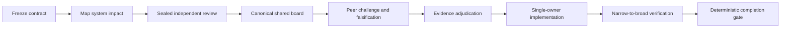

# Wide-Lens Review

Evidence-gated Codex Skill for independent review, shared subagent deliberation, repository-wide impact mapping, and forced divergent thinking.

用于复杂软件变更的 Codex Skill：先让多个代理独立审查，再进行共享质询，最后由主代理依据可复现实证裁决，而不是依赖多数票或主观置信度。

## Why

Local code can look correct while breaking hidden consumers, state transitions, migrations, rollback paths, or operational assumptions. Wide-Lens Review adds a bounded review protocol around the model:

- Map upstream inputs, downstream consumers, state, deployment, rollback, and verification surfaces.
- Generate deterministic, risk-sensitive review lanes, including a forced orthogonal wildcard.
- Keep Round 1 positions sealed to reduce peer anchoring.
- Share one canonical peer board in Round 2 and require cross-agent falsification.
- Resolve disagreements with executable checks and evidence, never by voting.
- Reject incomplete or internally inconsistent review records with a deterministic gate.

## Workflow



Shared mode is bounded to two or three reviewers, two turns per reviewer, one retry total, ten minutes per round, and a 65,536-byte peer board. Nested reviewers and reviewer writes are forbidden.

## Install

Clone the repository directly into a Codex-compatible personal Skill directory:

### Linux / macOS

```bash
git clone https://github.com/Mai-xiyu/wide-lens-review.git ~/.agents/skills/wide-lens-review
```

### Windows PowerShell

```powershell
git clone https://github.com/Mai-xiyu/wide-lens-review.git "$env:USERPROFILE\.agents\skills\wide-lens-review"
```

The repository root is the Skill root and contains `SKILL.md` directly.

## Use

Ask Codex to use the Skill explicitly:

```text
Use $wide-lens-review to review this cross-service migration with three shared subagents.
```

```text
使用 $wide-lens-review 对这个高风险 PR 做全局审查，并让三个 subagent 先独立判断、再共享质询。
```

The Skill should be used for cross-cutting changes, migrations, security or concurrency work, data-integrity changes, risky PRs, repository-wide audits, ambiguous multi-module failures, and explicit adversarial or multi-agent review requests. It intentionally stays inactive for ordinary isolated edits.

## CLI

Generate a shared three-reviewer packet:

```bash
python scripts/diverge.py \
  --task "Review a cross-service migration" \
  --path src/api.py \
  --path db/migration.sql \
  --risk high \
  --coordination shared \
  --reviewers 3 \
  --format json
```

Validate a completed evidence record:

```bash
python scripts/check_review.py --packet packet.json --report report.json
```

Run the regression suite:

```bash
python tests/run_eval.py --json
```

The scripts use only the Python standard library.

## Repository layout

```text
.
├── SKILL.md                 # Trigger metadata and agent workflow
├── agents/
│   └── openai.yaml          # Codex UI metadata
├── references/
│   ├── lenses.json          # Deterministic review-lane catalog
│   └── protocol.md          # Evidence and shared-discussion schema
├── scripts/
│   ├── diverge.py           # Risk-sensitive review packet generator
│   └── check_review.py      # Deterministic consistency gate
└── tests/
    ├── eval_cases.json      # Mutation and policy cases
    └── run_eval.py          # Test runner and subprocess oracles
```

## Validation model

The current suite contains 172 cases and requires a 100% fixed-case pass rate by default. It covers planner selection, shared-agent assignments, canonical prompts, peer-board digests, evidence schemas, timeout and retry accounting, malformed inputs, and two real subprocess oracles.

This rate measures the checked fixtures only. It is not a claim of universal defect recall, model accuracy, or proof that self-reported evidence is genuine. The gate deliberately does not execute commands embedded in an untrusted report.

## Security and limits

- Peer content is treated as untrusted inert data; embedded instructions must not be followed.
- A SHA-256 board digest detects inconsistent recorded boards, but cannot prove transport delivery.
- Prompt-level read-only instructions are not a sandbox. Use an enforced read-only environment when available.
- The gate checks record consistency; it cannot cryptographically prove Round 1 isolation, reviewer identity, or real-world correctness.
- The Skill improves orchestration and verification discipline. It does not change model weights or guarantee that every defect will be found.

## Keywords

Codex Skill, OpenAI Codex, multi-agent review, subagent orchestration, shared agents, adversarial review, code review, software architecture, repository audit, evidence-gated validation, devil's advocate, forced divergent thinking, agentic workflow.
