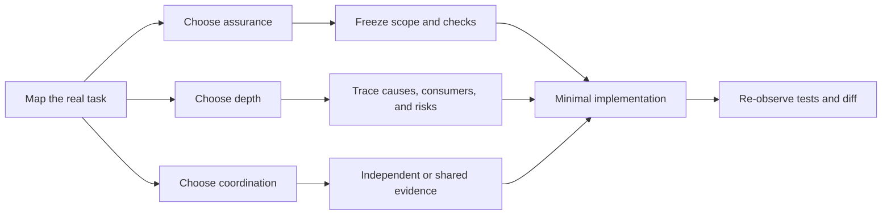

# Wide-Lens Engineering

**English** | [简体中文](README_CN.md)

**Practical-first software engineering for Codex, with evidence-gated assurance when risk demands it.**

[](https://learn.chatgpt.com/docs/customization/overview)


[](LICENSE)

<!-- section:overview -->
Wide-Lens Engineering is a reusable Codex workflow for feature implementation, debugging, refactoring, migrations, architecture changes, and code review. It is **not a review-only skill**.

Most changes need disciplined engineering, not maximum ceremony. This skill keeps ordinary work fast with a `practical` path and upgrades to an externally anchored `assured` protocol only when the risk or trust requirement justifies it.

| | `practical` | `assured` |
|---|---|---|
| Best for | Local, reversible, clearly scoped work | High-risk, externally consequential, or audit-required work |
| Evidence | Visible checkpoint, exact commands, Git status and diff | Frozen contract, deterministic packet, controller-observed gate |
| Cost | Low ceremony | Full repository scans and external trust infrastructure |
| Honest claim | The scoped checks and observed diff agree | The anchored packet and observed delivery agree |

<!-- invariant:assured-external-trust-root -->
> [!IMPORTANT]
> `assured` is not a label the agent can award itself. Without a real external controller, independent digest channel, pinned verifier, isolated artifacts, and OS sandbox, the skill must report that assured preconditions are unmet.

[Build Week](#build-week) · [Quick start](#quick-start) · [How it works](#how-it-works) · [Trust boundaries](#trust-boundaries) · [Installation](#installation) · [Testing](#testing)

<!-- section:build-week -->
<a id="build-week"></a>
## OpenAI Build Week

- **Category:** Developer Tools
- **Repository:** [github.com/Mai-xiyu/wide-lens-engineering](https://github.com/Mai-xiyu/wide-lens-engineering)
- **Primary `/feedback` session:** `019f67c4-9bd9-7581-8ae9-3cdd4453d9f7`
- **Demo video:** the public YouTube link will be added after owner review of the upload draft.

### 60-second deterministic judge check

From the repository root, with Python 3.10 or newer:

```bash
python -B tests/run_eval.py --threshold 1.0 --json
python -B tests/run_forward_eval.py --threshold 1.0 --require-no-skips --json
```

The first command checks the planner, routing policy, gate, security boundaries, and documentation contracts. The second runs the command-line surfaces as black boxes and fails if any case is skipped. No sample data, API key, account, third-party Python package, or network call is required.

To exercise the actual Skill in Codex, install it with the request in [Quick start](#quick-start), then use it on a disposable repository with a real failing test:

```text
Use $wide-lens-engineering to fix the currently failing test.
Choose assurance, depth, and coordination independently.
The active main model owns any subagent count; keep subagents read-only.
Show the pre-edit checkpoint, smallest causal diff, exact test result, and Git diff.
```

### Built with GPT-5.6 and Codex

The primary build thread above records `gpt-5.6-sol` in its local Codex session metadata throughout the core implementation. Codex performed repository-wide analysis, shared-subagent challenge, protocol and Python implementation, adversarial regression work, bilingual documentation, and terminal-based GitHub delivery. The session ID is supplied for evaluator verification; this README does not treat the model label alone as proof of correctness.

Key decisions made during that build:

| Decision | Why | Trade-off |
|---|---|---|
| Separate assurance, analysis depth, and coordination | Risk and information value are different questions | The main model must make three explicit choices |
| Keep `practical` and `assured` distinct | Ordinary coding stays fast while high-risk work can require external anchors | Full assured delivery needs infrastructure outside this repository |
| Let the main model choose subagents; keep one writer | Avoid fixed orchestration and concurrent-edit conflicts | Parallel agents provide evidence, not parallel code writes |
| Apply the Ponytail ladder after causal tracing | Reuse and standard-library solutions stay preferred | Minimalism cannot remove trust-boundary or regression checks |

### Runtime and platform scope

| Surface | Current claim |
|---|---|
| Windows, Git, Python 3.10+ | Verified in the release environment, including the forward suite with zero skips |
| macOS / Linux | POSIX installation and path handling are implemented and documented; not release-verified in this Windows build |
| Codex Desktop / CLI | Uses the standard Skill layout and can be installed globally or per repository |
| Assured `windows-win32` controller path | Windows only |

The fixed suites are protocol oracles, not a benchmark of universal model accuracy, defect recall, or independent security assurance.

<!-- section:quick-start -->
<a id="quick-start"></a>
## Quick start

For local use, paste this request into Codex so the built-in installer receives the repository path explicitly:

```text
Use $skill-installer to install this GitHub skill:
repo: Mai-xiyu/wide-lens-engineering
path: .
name: wide-lens-engineering
```

Then ask Codex to use it:

```text
Use $wide-lens-engineering to fix this local parser bug.
Keep the change minimal and verify the real callers.
```

For an ordinary low-risk fix, expect the skill to:

1. inspect repository policy and the existing Git state;
2. select assurance, analysis depth, and coordination separately;
3. publish the objective, allowed paths, and exact checks before editing;
4. make the smallest correction at the shared cause;
5. run the exact checkpoint checks and report the actual diff and residual risk.

See [Installation](#installation) for manual and repository-scoped options.

<!-- section:how-it-works -->
<a id="how-it-works"></a>
## How it works

<!-- invariant:axes-independent -->
Every task selects one intent and three independent axes.

### Intent

- `change` — implement, refactor, migrate, or change architecture.
- `debug` — reproduce, find the earliest shared cause, fix it, and preserve regression evidence.
- `review` — inspect and report without writing.

### Three independent axes

| Axis | Choices | What it decides |
|---|---|---|
| Assurance | `practical` / `assured` | How the delivery claim is established |
| Depth | `focused` / `full` | How broad the causal and risk analysis must be |
| Coordination | `independent` / `shared` | Whether evidence is developed alone or through multi-agent challenge |

`full` does not automatically mean `assured`. `assured` does not automatically require `shared`. Agent count never determines either one.

Typical routes:

| Task | Likely route |
|---|---|
| Small local bug with direct tests | `practical / focused / independent` |
| Reversible cross-module refactor | `practical / full`, with coordination chosen by the main model |
| Authorization migration or credential handling | `assured / full` |
| Read-only code review | `review` intent; no writes |



<!-- section:practical -->
<a id="practical-workflow"></a>
## Practical workflow

Use `practical` only when the work is local, reversible, clearly scoped, and free of security, credentials, privacy, persistent-data, concurrency, public-API, deployment, infrastructure, repository-external effects, or other irreversible boundaries.

The workflow is deliberately short:

1. capture the initial Git state and preserve unrelated work;
2. publish a user-visible checkpoint with objective, non-goals, allowed paths, and exact acceptance commands;
3. trace the real entry point, shared correction point, consumers, failure path, and smallest counterexample;
4. implement through the Ponytail minimalism ladder;
5. compare final staged, unstaged, and untracked state with the checkpoint.

Practical evidence is useful engineering evidence, not an attestation. It cannot authenticate the actor, prove chronology, confine the process, or observe every repository-external effect.

Read the normative [practical workflow](references/practical.md).

<!-- section:assured -->
<a id="assured-workflow"></a>
## Assured workflow

The skill must upgrade to `assured` for security or authorization changes, secrets and credentials, privacy or compliance, schema/data migration, deletion and recovery, concurrency, distributed consistency, public APIs, deployment, infrastructure, repository-external effects, irreversible actions, material checkpoint revisions, or explicit audit/attestation requests.

Assured delivery keeps the existing protocol v4 wire format:

- external baseline manifest v2;
- authority-complete frozen contract;
- deterministic packet v4 with an independently published digest;
- pinned verifier and isolated artifacts;
- controller-observed acceptance commands and final repository state;
- required runtime receipt when coordination is `shared`.

The Agent-authored report is evidence only. It cannot add acceptance criteria, expand write scope, or become task authority at the end.

Read the normative [assured protocol v4](references/protocol.md).

<!-- section:shared-subagents -->
<a id="shared-subagents"></a>
## Adaptive shared subagents

<!-- invariant:main-model-selects-subagents -->
The **active main model alone** decides whether subagents add value and, if used, their identities, count, and lane assignments.

<!-- invariant:no-fixed-participant-count -->
The skill contains no exact, default, or maximum participant count.

Shared coordination follows four rules:

1. each subagent forms a sealed position before seeing peer conclusions;
2. every participant receives the same peer board;
3. the second round must challenge, falsify, or materially test another position;
4. the main thread adjudicates with discriminating evidence, never votes or confidence.

<!-- invariant:subagents-read-only -->
<!-- invariant:no-recursive-delegation -->
<!-- invariant:main-thread-only-writer -->
Subagents remain read-only, recursive delegation is forbidden, and the main thread is the only writer and integrator. In practical mode the discussion is Agent evidence; in assured mode a real controller receipt is required.

<!-- section:ponytail -->
<a id="ponytail"></a>
## Minimal by construction

After understanding the causal surface, the implementation stops at the first Ponytail rung that works:

```text
not-needed → reuse → stdlib → native → existing-dependency → minimal-custom
```

The ladder rejects speculative abstractions, dependencies, configuration, and scaffolding. It never removes trust-boundary validation, data-loss guards, required error paths, accessibility, explicit acceptance criteria, or the smallest useful regression.

<!-- section:examples -->
<a id="examples"></a>
## Example prompts

### Feature or bug fix

```text
Use $wide-lens-engineering to implement this feature.
Choose assurance, depth, and coordination independently.
Keep subagents read-only and make the smallest verified change.
```

### High-assurance change

```text
Use $wide-lens-engineering in assured mode for this authorization migration.
Do not proceed unless the controller, digest anchors, pinned verifier,
artifact isolation, and OS sandbox are real.
```

### Let the main model decide collaboration

```text
Use $wide-lens-engineering for this cross-module refactor.
The active main model must decide whether shared subagents add information,
including their identities, count, and lane assignments.
```

<!-- section:trust-boundaries -->
<a id="trust-boundaries"></a>
## Trust boundaries

| Capability | `practical` | `assured` with real external infrastructure |
|---|---:|---:|
| Visible objective, scope, and acceptance checkpoint | Yes | Yes, frozen in the packet |
| Exact commands and actual Git diff | Agent-observed | Controller re-observed |
| Prevent report-added acceptance commands | Procedural rule | Gate-enforced |
| Independent packet/verifier/receipt digest | No | Yes |
| Authenticate authority or controller identity | No | Only with external authentication/signing |
| Confine network, credentials, external writes, and child processes | No | Requires an OS sandbox |
| Guarantee real-world correctness or defect recall | No | No |

Hashes prove content consistency, not identity, chronology, or independence by themselves. A digest printed by the same untrusted session is not an external trust anchor.

### Git worktrees and links

Practical mode can operate in a Git worktree, but external Git metadata remains outside its guarantee. It must not write through a symlink, junction, reparse point, or linked parent without explicit authorization and an appropriate trusted-root model.

Assured protocol v4 fails closed on external `.git` gitfiles, symlinks, junctions, and reparse points.

<!-- section:installation -->
<a id="installation"></a>
## Installation

### Requirements

- Codex
- Git
- Python 3.10 or newer
- no third-party Python runtime dependencies

### Local install with the skill installer

```text
Use $skill-installer to install this GitHub skill:
repo: Mai-xiyu/wide-lens-engineering
path: .
name: wide-lens-engineering
```

The explicit `path: .` matters because the Skill lives at the repository root; a bare repository URL is not a complete installer source.

This repository is the Skill source, not a packaged Codex plugin. OpenAI treats Skills as the authoring format and plugins as the installable distribution unit for other people or workspaces. Use a plugin package for marketplace or team distribution.

### Manual global install

Current Codex documentation places global skills under `$HOME/.agents/skills`.

macOS / Linux:

```bash
mkdir -p "$HOME/.agents/skills"
git clone https://github.com/Mai-xiyu/wide-lens-engineering.git \
  "$HOME/.agents/skills/wide-lens-engineering"
```

PowerShell:

```powershell
$target = Join-Path $HOME '.agents\skills\wide-lens-engineering'
New-Item -ItemType Directory -Force (Split-Path $target) | Out-Null
git clone https://github.com/Mai-xiyu/wide-lens-engineering.git $target
```

For repository-scoped use, place this skill folder at `.agents/skills/wide-lens-engineering` inside the target repository.

Invoke it explicitly with `$wide-lens-engineering`, or let Codex select it when the task matches the skill description.

<!-- section:testing -->
<a id="testing"></a>
## Testing

Run the release suites from the skill root:

```bash
python -B tests/run_eval.py --threshold 1.0 --json
python -B tests/run_forward_eval.py --threshold 1.0 --require-no-skips --json
git diff --check
```

The first suite covers deterministic planner, gate, security, routing-policy, and documentation contracts. The second treats the protocol CLIs as black boxes and requires zero skipped cases.

A 100% fixed-suite result proves only that every declared oracle passed. It is not a claim of universal model-routing accuracy, real-world defect recall, or independent security audit.

<!-- section:repository-map -->
<a id="repository-map"></a>
## Repository map

```text
wide-lens-engineering/
├── LICENSE                  # MIT license
├── SKILL.md                 # Router and shared engineering rules
├── README.md                # English documentation
├── README_CN.md             # 简体中文文档
├── agents/openai.yaml       # Codex UI metadata
├── references/
│   ├── practical.md         # Low-overhead workflow
│   ├── protocol.md          # Assured protocol v4
│   └── lenses.json          # Analysis lens catalog
├── scripts/                 # Deterministic packet and gate tools
└── tests/                   # Deterministic and black-box release suites
```

The repository root is the skill root; there is no extra nested project directory.

<!-- section:references -->
<a id="references"></a>
## Documentation references

The README structure follows useful patterns from the [OpenAI Plugins examples](https://github.com/openai/plugins), [Anthropic Skills](https://github.com/anthropics/skills), [Agent Skills specification](https://github.com/agentskills/agentskills), [Superpowers](https://github.com/obra/superpowers), and [Vercel Skills](https://github.com/vercel-labs/skills).

Technical design references:

- [OpenAI Build skills](https://learn.chatgpt.com/docs/build-skills) — Skill authoring, progressive disclosure, and plugin distribution.
- [OpenAI Codex customization](https://learn.chatgpt.com/docs/customization/overview) — skills, progressive disclosure, and subagents.
- [SLSA attestation model](https://slsa.dev/spec/v1.2/attestation-model) and [in-toto](https://in-toto.io/) — external subjects, digests, and signed attestations.
- [Microsoft file-stream and path APIs](https://learn.microsoft.com/en-us/windows/win32/api/fileapi/) — Windows path, stream, and alias boundaries.

<details>
<summary>Search keywords</summary>

Codex Skill, OpenAI Codex, coding agent, practical coding workflow, assured software delivery, feature implementation, debugging, root-cause analysis, bug fixing, refactoring, migration, architecture, code review, multi-agent systems, shared subagents, adaptive agent orchestration, immutable contract, external trust anchor, controller receipt, evidence-gated delivery, adversarial testing, divergent thinking, Git diff verification, Git worktree, Ponytail, YAGNI, minimal implementation.

</details>
