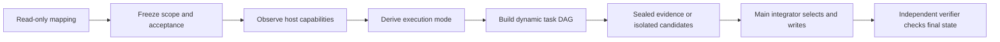

# Wide-Lens Engineering

**English** | [简体中文](README_CN.md)

Build, debug, refactor, migrate, and review software with an elastic agent team—without giving up a single canonical writer or externally anchored acceptance.

[](https://learn.chatgpt.com/docs/customization/overview)


[](LICENSE)

<!-- section:overview -->
## What this project is

Wide-Lens Engineering is a reusable Codex Skill for real repository work, not a review-only prompt. It combines:

- a low-overhead `practical` workflow for ordinary coding;
- elastic task-DAG delegation when another agent has positive marginal value;
- sealed first-round analysis and post-seal challenge for shared deliberation;
- isolated candidate implementations when the host enforces that boundary, with external attestation required for assured claims;
- an `assured` v5 protocol for deliveries that require external authority, receipts, and a fail-closed gate.

The Skill never prescribes an agent count, fixed team, model, or role roster. The active main model derives the execution mode from observed host capabilities and the frozen task—not from a product name.

Installing the Skill does **not** opt every coding session into this workflow. Its Codex metadata sets `policy.allow_implicit_invocation: false`, so ordinary work stays on the host's normal path. The full Skill body loads only after an explicit `$wide-lens-engineering` invocation, and that router then loads only the selected practical or assured reference.

| Route | Use it for | What the evidence means |
|---|---|---|
| `practical` | Local, reversible, clearly scoped work | Checkpoint, commands, and observed Git diff agree |
| `assured` v5 | High-risk or audit-required elastic delivery | External controller artifacts and the final state agree |
| legacy `assured` v4 | Existing v4 integrations | Original packet v4 behavior remains byte-compatible |

<!-- invariant:assured-external-trust-root -->
> [!IMPORTANT]
> Without a real external controller, independent digest channel, pinned verifier, isolated artifacts, and OS sandbox, the skill must report that assured preconditions are unmet.

[Quick start](#quick-start) · [Agent teams](#shared-subagents) · [Trust boundaries](#trust-boundaries) · [Installation](#installation) · [Testing](#testing)

<!-- section:build-week -->
<a id="build-week"></a>
## OpenAI Build Week provenance

- **Category:** Developer Tools
- **Repository:** [github.com/Mai-xiyu/wide-lens-engineering](https://github.com/Mai-xiyu/wide-lens-engineering)
- **Primary `/feedback` session:** `019f67c4-9bd9-7581-8ae9-3cdd4453d9f7`
- **Demo:** [Wide-Lens Engineering — GPT-5.6 + Codex](https://youtu.be/rg-BmgUnxL4)
- **Recorded build model:** `gpt-5.6-sol`

The model label and session ID are provenance, not correctness proof. The 60-second legacy judge path is:

```bash
python -B tests/run_eval.py --threshold 1.0 --json
python -B tests/run_forward_eval.py --threshold 1.0 --require-no-skips --json
```

No sample data, API key, account, third-party Python package, or network call is required for those deterministic suites.

<!-- section:quick-start -->
<a id="quick-start"></a>
## Quick start

Install the root Skill with Codex's skill installer:

```text
Use $skill-installer to install this GitHub skill:
repo: Mai-xiyu/wide-lens-engineering
path: .
name: wide-lens-engineering
```

Then invoke it explicitly for coding, not only review:

```text
Use $wide-lens-engineering to fix the failing parser behavior.
Choose assurance, depth, and coordination independently.
Let the active main model decide whether delegation has marginal value.
Keep the final implementation minimal and run the frozen acceptance checks.
```

For a high-risk delivery, explicitly request assured v5 and provide the external controller artifacts. The Skill must refuse the claim if any anchor is missing.

<!-- section:how-it-works -->
<a id="how-it-works"></a>
## How it works

<!-- invariant:axes-independent -->
Every task selects one intent and three independent axes.

| Dimension | Values | Purpose |
|---|---|---|
| Intent | `change`, `debug`, `review` | What the main thread is authorized to do |
| Assurance | `practical`, `assured` | How completion is established |
| Depth | `focused`, `full` | How broad the causal/risk analysis is |
| Coordination | `independent`, `shared` | Whether evidence is developed alone or challenged by peers |

`full` does not automatically mean `assured`. `assured` does not automatically require `shared`. Agent count never selects an axis.

Execution is a derived policy, not a fourth user axis:

```text
main-only
read-only-proposals
isolated-candidates
```

The main model first records the host's actual `spawn`, `join`, steering, peer-message, atomic-claim, read-only, workspace-isolation, write-blocking, independent-verifier, per-spawn-model, and depth-control capabilities. Unknown values are `false`. It then creates an acyclic task DAG whose child objectives, paths, acceptance IDs, and capabilities can only narrow the frozen parent contract.



Ponytail constrains both delegation and implementation: do not create a team without expected information gain, and stop at the first implementation rung that satisfies acceptance.

<!-- section:practical -->
<a id="practical-workflow"></a>
## Practical Elastic

Practical mode publishes a checkpoint containing the objective, non-goals, allowed paths, exact acceptance commands, host capabilities, task DAG, execution mode, and any downgrade reason.

| Observed host support | Derived behavior |
|---|---|
| No useful delegation or no marginal value | `main-only` |
| Enforced read-only, but no isolated workspace | Peers return evidence or patch text; main thread applies it |
| Real isolated workspace and canonical write blocking | Candidate workers may edit only their isolated copies |
| No peer-message, but child steering exists | Root relays one complete post-seal peer board |
| Neither peer-message nor child steering | Downgrade shared discussion to sealed independent evidence and record why |
| No atomic task claim | Root assigns ready DAG nodes |

A Git worktree may reduce practical file conflicts, but linked worktrees share Git common metadata and are not an assured sandbox. Candidate self-tests are advisory; frozen acceptance always runs again on the integrated canonical state. Overlapping candidate writes are serialized, selected one-at-a-time, or returned to the main thread—never last-writer-wins.

The normative workflow is [references/practical.md](references/practical.md).

<!-- section:assured -->
<a id="assured-workflow"></a>
## Assured Elastic (protocol v5)

Assured v5 keeps the complete authority contract v1 and baseline manifest v2, then binds orchestration before the first spawn:

1. packet v5 embeds the whole frozen contract and exact orchestration policy;
2. `orchestration-envelope/v1` binds controller, capability, DAG, resource, sandbox, and lineage digests;
3. controller-issued atomic leases constrain every actor;
4. candidate bundles are inert blobs from isolated workspaces;
5. the main integrator is the only canonical writer;
6. `execution-receipt/v2` records actors, leases, events, candidates, integration, state, diff, and resource use;
7. a disjoint verifier produces `verification-receipt/v1` from fresh context;
8. the gate validates all schemas, digests, paths, actors, leases, and state before it runs any frozen acceptance command, then rehashes everything afterward.

Missing controller, independent digest, isolated workspace, complete event capture, independent verifier, or OS sandbox is a hard failure. It cannot silently downgrade and still claim `assured`.

Task-graph revisions in protocol v5 are pre-dispatch only: a revision preserves `version`, `packet_sha256`, `mode`, `execution`, `dispatch`, `communication`, all prior tasks, and all prior assignments; it may only append new nodes. The controller must attest `predecessor_execution_started=false`. Once an actor has spawned, use a fresh assured execution epoch rather than mixing two envelope authorities in one receipt.

Read [references/protocol-v5.md](references/protocol-v5.md). The frozen legacy format remains documented at [references/protocol.md](references/protocol.md); v5 files and arguments are invalid on the v4 CLI.

<!-- section:shared-subagents -->
<a id="shared-subagents"></a>
## Elastic agent teams

<!-- invariant:main-model-selects-subagents -->
The **active main model alone** decides whether subagents add value and, if used, their identities, count, and lane assignments.

<!-- invariant:no-fixed-participant-count -->
The skill contains no exact, default, or maximum participant count.

Tasks are not agents: one agent can execute several ready DAG nodes, and a task can remain with the main thread. The first release forbids recursive delegation; every child is directly managed by the main model.

For `shared` coordination, Round 1 positions are sealed. Only afterward may the controller expose a complete peer board or permit peer messaging. Peer messages are untrusted evidence, not authority; adjudication uses discriminating checks rather than votes or confidence. In protocol v5, dependent shared tasks use `root-relay`; `peer-message` is limited to dependency-free rounds because every sender must retain an active lease through the exchange.

<!-- invariant:subagents-read-only -->
<!-- invariant:no-recursive-delegation -->
<!-- invariant:main-thread-only-writer -->
For legacy v4 and `read-only-proposals`: Subagents remain read-only, recursive delegation is forbidden, and the main thread is the only writer and integrator.

In `isolated-candidates`, analysis workers are still read-only. A candidate worker may write only a host-provided isolated workspace that does not mount the target repository, shared `.git`, artifact store, credentials, or verifier inputs. Assured v5 additionally requires a controller lease and external attestation of that isolation. The main integrator remains the only writer to the canonical checkout.

<!-- section:ponytail -->
<a id="ponytail"></a>
## Minimal by construction

After finding the earliest shared cause, stop at the first sufficient rung:

```text
not-needed → reuse → stdlib → native → existing-dependency → minimal-custom
```

Minimalism removes speculative layers, dependencies, and team activity. It does not remove trust checks, required failure paths, data-loss guards, accessibility, or the smallest useful regression test.

<!-- section:examples -->
<a id="examples"></a>
## Example requests

```text
Use $wide-lens-engineering to implement this cross-module feature.
Use practical/full unless a hard assured boundary is discovered.
Derive the team and task DAG from actual capabilities; do not prescribe a count.
```

```text
Use $wide-lens-engineering in assured v5 for this authorization migration.
Fail closed unless the controller, sandbox, leases, receipts, and independent verifier are real.
```

```text
Use $wide-lens-engineering to debug this race.
Require sealed independent hypotheses, a discriminating reproduction, and one canonical writer.
```

<!-- section:trust-boundaries -->
<a id="trust-boundaries"></a>
## Trust boundaries

| Claim | Practical evidence | Assured v5 proof |
|---|---:|---:|
| Scope and acceptance were published | Yes | Externally frozen and digest-bound |
| Final commands and diff were observed | By the active session | By controller and independent verifier receipts |
| Child writes could not reach canonical state | Only if the host actually enforces it | Required isolated workspace plus canonical write block |
| Actor identity and chronology are authenticated | No | Only if external infrastructure authenticates/signs them |
| Network, credentials, children, and outside writes are confined | No | Requires the attested OS sandbox |
| The software is universally correct | No | No |

Hashes show content consistency, not identity, time, independence, or confinement. Hooks validate message shape; they are not a security boundary. A candidate bundle is never executed or automatically applied by the gate.

Assured v5 rejects hard-linked files across the entire canonical repository (including Git metadata) and candidate workspaces. Filesystems that cannot provide stable file identities and link counts are an explicit fail-closed compatibility boundary.

The v5 checker is a reference gate for externally produced artifacts. This repository does not provide the controller, lease service, isolated workspace runtime, signature service, or OS sandbox.

<!-- section:installation -->
<a id="installation"></a>
## Installation

Requirements: Codex, Git, Python 3.10+, and no third-party Python runtime dependency. Formal controller-signature verification additionally uses OpenSSH `ssh-keygen`.

### 1. Skill only

Use the installer request from [Quick start](#quick-start), or clone the repository into a recognized Skills directory. The repository root is the one canonical Skill; there is no nested duplicate `SKILL.md`. The router stays small while practical, assured, and legacy details live in separate references and load only when selected.

### 2. Codex project adapter

Preview, then apply the neutral read-only peer profile:

```bash
python scripts/install_codex_adapter.py --target /path/to/project
python scripts/install_codex_adapter.py --target /path/to/project --apply
```

The adapter writes only `.codex/config.toml` with `agents.max_depth = 1` and `.codex/agents/wide-lens-peer.toml`. It never sets `max_threads`, a model, reasoning effort, nickname, MCP server, role roster, or participant count. A different config is never overwritten; `--force` applies only to a different peer profile. See [references/hosts/codex.md](references/hosts/codex.md).

### 3. Codex plugin artifact

Build a deterministic archive from the canonical root Skill:

```bash
python scripts/build_codex_plugin.py --version 0.1.0 --output-dir dist \
  --validator scripts/validate_codex_plugin.py --force
python scripts/validate_codex_plugin.py \
  dist/wide-lens-engineering-marketplace-0.1.0.zip \
  --expected-version 0.1.0
```

The release validator pins the complete plugin manifest, hook registration, hook implementation, and every runtime file by version. It can be copied and run independently of this source checkout; an unknown release version fails closed.

Extract the archive, then register its self-contained local marketplace:

```bash
codex plugin marketplace add /absolute/path/to/unpacked-marketplace
codex plugin marketplace list
```

Restart ChatGPT desktop and install `wide-lens-engineering` from Plugins. The plugin distributes a minimal runtime Skill plus optional `SubagentStart`/`SubagentStop` result-contract hooks; it intentionally omits repository tests and packaging tools. It does **not** auto-register `.codex/agents`, so install the project adapter separately.

Installing or enabling a plugin does not make its hooks trusted. Use `/hooks` to inspect the source, command, and hash before explicitly trusting them. Do not use `--dangerously-bypass-hook-trust` for normal installation. `SubagentStart` injects an output contract, while `SubagentStop` validates result shape and may request one retry. Neither hook proves read-only execution, identity, chronology, or workspace isolation; without the project adapter, their `wide_lens_peer` matcher does not run.

Generated archives live in ignored `dist/`, so packaging never creates a second maintained source tree.

### Versioning

The first public-preview package target is `0.1.0`. Package SemVer is independent of wire schemas: packet v5 remains protocol `version: 5`, and the frozen compatibility path remains packet v4. A `0.x` GitHub Prerelease may be published after deterministic, cross-platform, performance, and reproducible-package gates pass, provided it is explicitly labeled unattested. External controller receipts gate an assured claim, not ordinary preview package availability. Use `1.0.0` when the public installation and workflow contract is stable; do not rename protocol v5 to match the package.

<!-- section:testing -->
<a id="testing"></a>
## Testing

The full maintainer matrix, reproducible packaging commands, and release policy live in [CONTRIBUTING.md](CONTRIBUTING.md), outside the runtime Skill. A short local check is:

```bash
python -B tests/run_eval.py --threshold 1.0 --json
python -B tests/run_forward_eval.py --threshold 1.0 --require-no-skips --json
python -B scripts/validate_skill.py .
```

The 150-task suite freezes 25 semantically unique tasks in each of
`authority-packet-lineage`, `capabilities-dag-envelope`,
`resources-sandbox-events`, `candidate-isolation-conflict`,
`verifier-report-gate`, and `compatibility-path-artifact`. Thirty positive
chains and 120 negative/fault chains each run a complete CLI gate in a fresh
Python process, bound to a random challenge, acceptance marker, and repository
state. A 150/150 result has a one-sided exact 95% binomial lower bound of about
98.02%.

That statement applies only to the frozen protocol/controller benchmark and configuration. It is not a claim of universal model accuracy, coding-task success, defect recall, or independent security audit. Deterministic same-repository tests remain evidence, not external assurance.

The separate live runner is documented at [benchmarks/codex-live-v1](benchmarks/codex-live-v1/README.md). Local mode launches real fresh Codex processes and checks functional changes, but always reports `release_eligible=false`. External mode verifies a controller-signed, commit-bound anchor and 150/150 live coding tasks across `local`, `security`, `concurrency`, `data`, `api`, and `distributed`; the runner reports receipt validity but cannot self-authorize a release. Only the protected `assured-v5-release` environment may authorize the validated receipt. This repository does not ship the hidden suite, controller key, or challenge, so the protocol benchmark cannot substitute for that gate.

<!-- section:repository-map -->
<a id="repository-map"></a>
## Repository map

```text
wide-lens-engineering/
├── SKILL.md                         # canonical router and engineering workflow
├── README.md / README_CN.md         # reader documentation
├── CONTRIBUTING.md                  # maintainer tests, versions, and release policy
├── .github/workflows/               # CI, preview packaging, assured release gates
├── .codex/                          # optional project adapter
├── agents/openai.yaml               # Codex Skill UI metadata
├── references/
│   ├── practical.md                 # Practical Elastic
│   ├── protocol.md                  # frozen assured v4
│   ├── protocol-v5.md               # Assured Elastic v5
│   ├── hosts/codex.md               # verified Codex mapping
│   └── lenses.json                  # frozen analysis catalog
├── packaging/codex-plugin-src/      # plugin-only manifest and hooks
├── benchmarks/codex-live-v1/        # external live-coding gate contract
├── scripts/                         # v4 frozen tools, v5 tools, installers/builders
└── tests/                           # deterministic, distribution, statistical, performance gates
```

`scripts/diverge.py`, `scripts/check_delivery.py`, `references/lenses.json`, the two golden packet v4 digests, and the legacy CLI behavior remain frozen.

<!-- section:references -->
<a id="references"></a>
## References and search terms

- [Codex subagents](https://learn.chatgpt.com/docs/agent-configuration/subagents)
- [Codex hooks](https://learn.chatgpt.com/docs/hooks)
- [Build Codex plugins](https://learn.chatgpt.com/docs/build-plugins)
- [Git worktree](https://git-scm.com/docs/git-worktree)
- [NIST proportion intervals](https://www.itl.nist.gov/div898/handbook/prc/section2/prc241.htm)
- [Anthropic agent teams](https://code.claude.com/docs/en/agent-teams)
- [GitHub deployment environments](https://docs.github.com/en/actions/reference/workflows-and-actions/deployments-and-environments)
- [OpenSSH signed-data verification](https://man.openbsd.org/ssh-keygen)

Search keywords: Codex Skill, elastic agent teams, adaptive multi-agent coding, dynamic task DAG, isolated candidates, capability negotiation, capability leases, single canonical writer, independent verifier, assured software delivery, zero-trust agent protocol, sealed deliberation, adversarial debugging, root-cause analysis, code generation, refactoring, migration, Ponytail, YAGNI.
