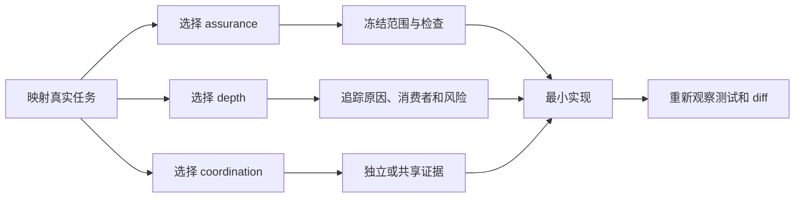

# Wide-Lens Engineering

[English](README.md) | **简体中文**

**面向 Codex 的实用优先软件工程 Skill；只有风险真正需要时，才升级到证据门禁的高保证交付。**

[](https://learn.chatgpt.com/docs/customization/overview)


<!-- section:overview -->
Wide-Lens Engineering 是一个可复用的 Codex 工作流，覆盖功能实现、调试、重构、迁移、架构修改和代码审查。它**不是只用于 review 的 Skill**。

大多数改动需要严谨工程，而不是最高规格的手续。这个 Skill 让普通任务走快速的 `practical` 路径；只有风险或可信要求足够高时，才升级到外部锚定的 `assured` 协议。

| | `practical` | `assured` |
|---|---|---|
| 适用场景 | 局部、可回滚、范围清晰的工作 | 高风险、有仓库外影响或要求审计的工作 |
| 证据 | 可见 checkpoint、精确命令、Git 状态和 diff | 冻结合同、确定性 packet、controller 重观察 gate |
| 成本 | 低手续 | 全仓扫描和外部可信基础设施 |
| 能诚实声明什么 | 范围内检查与观察到的 diff 一致 | 锚定 packet 与观察到的交付一致 |

<!-- invariant:assured-external-trust-root -->
> [!IMPORTANT]
> `assured` 不是 Agent 可以自行授予的标签。缺少真实外部 controller、独立摘要通道、固定 verifier、隔离工件和 OS sandbox 时，Skill 必须报告 assured 前置条件不成立。

[快速开始](#quick-start) · [工作方式](#how-it-works) · [信任边界](#trust-boundaries) · [安装](#installation) · [测试](#testing)

<!-- section:quick-start -->
<a id="quick-start"></a>
## 快速开始

本地使用时，把下面这段请求发给 Codex，让内置安装器显式收到仓库内路径：

```text
Use $skill-installer to install this GitHub skill:
repo: Mai-xiyu/wide-lens-engineering
path: .
name: wide-lens-engineering
```

然后让 Codex 使用它：

```text
Use $wide-lens-engineering to fix this local parser bug.
Keep the change minimal and verify the real callers.
```

对于普通低风险修复，预期流程是：

1. 检查仓库规则和已有 Git 状态；
2. 分别选择保证级别、分析深度和协作方式；
3. 编辑前公开目标、允许路径和精确检查；
4. 在最早公共原因处做最小修正；
5. 运行 checkpoint 中的精确检查，并报告实际 diff 与残余风险。

手动安装和仓库级安装见[安装](#installation)。

<!-- section:how-it-works -->
<a id="how-it-works"></a>
## 工作方式

<!-- invariant:axes-independent -->
每个任务分别选择一个 intent 和三个互相独立的轴。

### Intent

- `change` —— 实现功能、重构、迁移或修改架构。
- `debug` —— 复现问题、找到最早公共原因、修复并保留回归证据。
- `review` —— 只检查和报告，不写入文件。

### 三个独立轴

| 轴 | 选项 | 决定什么 |
|---|---|---|
| Assurance | `practical` / `assured` | 交付声明如何建立 |
| Depth | `focused` / `full` | 因果与风险分析需要多宽 |
| Coordination | `independent` / `shared` | 独立形成证据，还是进行多代理交叉挑战 |

`full` 不自动等于 `assured`，`assured` 也不自动要求 `shared`。Agent 数量不决定其中任何一个轴。

典型路由：

| 任务 | 常见选择 |
|---|---|
| 有直接测试的小型局部缺陷 | `practical / focused / independent` |
| 可回滚的跨模块重构 | `practical / full`，coordination 由主模型决定 |
| 授权迁移或凭据处理 | `assured / full` |
| 只读代码审查 | `review` intent；禁止写入 |



<!-- section:practical -->
<a id="practical-workflow"></a>
## Practical 工作流

只有工作局部、可回滚、范围清晰，并且不涉及安全、凭据、隐私、持久化数据、并发、公共 API、部署、基础设施、仓库外副作用或其他不可逆边界时，才能使用 `practical`。

流程有意保持简短：

1. 记录初始 Git 状态并保留无关用户改动；
2. 发布用户可见 checkpoint，写清目标、非目标、允许路径和精确验收命令；
3. 追踪真实入口、公共修正点、消费者、失败路径和最小反例；
4. 通过 Ponytail 最小化阶梯实现；
5. 将最终 staged、unstaged 和 untracked 状态与 checkpoint 对比。

Practical 证据是有价值的工程证据，但不是 attestation。它不能认证执行者、证明时序、约束进程，也不能观察全部仓库外副作用。

阅读规范性的 [practical 工作流](references/practical.md)。

<!-- section:assured -->
<a id="assured-workflow"></a>
## Assured 工作流

涉及安全或授权、密钥与凭据、隐私或合规、schema/数据迁移、删除与恢复、并发、分布式一致性、公共 API、部署、基础设施、仓库外副作用、不可逆操作、实质性 checkpoint 修订，或用户明确要求审计/attestation 时，Skill 必须升级到 `assured`。

Assured 交付保持现有 protocol v4 wire 格式：

- 外部 baseline manifest v2；
- authority 完整的冻结合同；
- 确定性 packet v4 和独立发布的摘要；
- 固定 verifier 与隔离工件；
- controller 观察的验收命令和最终仓库状态；
- coordination 为 `shared` 时强制要求 runtime receipt。

Agent 编写的 report 只是证据。它不能在结束阶段新增验收标准、扩大写入范围或反过来成为任务权威。

阅读规范性的 [assured protocol v4](references/protocol.md)。

<!-- section:shared-subagents -->
<a id="shared-subagents"></a>
## 自适应共享 Subagents

<!-- invariant:main-model-selects-subagents -->
是否需要 subagent，以及采用哪些身份、数量和 lane assignments，**只由当前主模型**决定。

<!-- invariant:no-fixed-participant-count -->
Skill 不包含精确、默认或最大参与者数量。

Shared coordination 遵循四条规则：

1. 每个 subagent 在看到其他结论前先形成密封立场；
2. 所有参与者收到同一份 peer board；
3. 第二轮必须挑战、证伪或实质检验其他立场；
4. 主线程依据判别性证据裁决，不投票、不比较信心值。

<!-- invariant:subagents-read-only -->
<!-- invariant:no-recursive-delegation -->
<!-- invariant:main-thread-only-writer -->
Subagent 保持只读，禁止递归委派，主线程是唯一写入者和集成者。Practical 模式下讨论记录只是 Agent evidence；assured 模式下必须有真实 controller receipt。

<!-- section:ponytail -->
<a id="ponytail"></a>
## 从设计上保持最小

理解完整因果面后，实现停在第一个能工作的 Ponytail 层级：

```text
not-needed → reuse → stdlib → native → existing-dependency → minimal-custom
```

这条阶梯拒绝推测性抽象、依赖、配置和脚手架，但不会删掉信任边界验证、数据丢失保护、必要错误路径、可访问性、明确验收标准或最小有用回归。

<!-- section:examples -->
<a id="examples"></a>
## 提示词示例

### 功能或缺陷修复

```text
Use $wide-lens-engineering to implement this feature.
Choose assurance, depth, and coordination independently.
Keep subagents read-only and make the smallest verified change.
```

### 高保证改动

```text
Use $wide-lens-engineering in assured mode for this authorization migration.
Do not proceed unless the controller, digest anchors, pinned verifier,
artifact isolation, and OS sandbox are real.
```

### 让主模型决定是否协作

```text
Use $wide-lens-engineering for this cross-module refactor.
The active main model must decide whether shared subagents add information,
including their identities, count, and lane assignments.
```

<!-- section:trust-boundaries -->
<a id="trust-boundaries"></a>
## 信任边界

| 能力 | `practical` | 有真实外部基础设施的 `assured` |
|---|---:|---:|
| 可见的目标、范围与验收 checkpoint | 是 | 是，冻结进 packet |
| 精确命令与实际 Git diff | Agent 观察 | Controller 重新观察 |
| 阻止 report 新增验收命令 | 流程规则 | Gate 强制 |
| 独立 packet/verifier/receipt digest | 否 | 是 |
| 认证 authority 或 controller 身份 | 否 | 仅在外部认证/签名存在时 |
| 限制网络、凭据、仓库外写入和子进程 | 否 | 需要 OS sandbox |
| 保证真实世界正确率或缺陷召回 | 否 | 否 |

哈希本身只证明内容一致性，不证明身份、时序或独立性。同一个未受信会话打印的摘要不是外部可信锚点。

### Git worktree 与链接

Practical 模式可以在 Git worktree 中工作，但外置 Git 元数据不属于它的保证范围。没有明确授权和合适的可信根模型时，不得通过 symlink、junction、reparse point 或 linked parent 写入。

Assured protocol v4 对外置 `.git` gitfile、symlink、junction 和 reparse point 采取 fail closed。

<!-- section:installation -->
<a id="installation"></a>
## 安装

### 要求

- Codex
- Git
- Python 3.10 或更高版本
- 无第三方 Python 运行时依赖

### 使用 Skill 安装器进行本地安装

```text
Use $skill-installer to install this GitHub skill:
repo: Mai-xiyu/wide-lens-engineering
path: .
name: wide-lens-engineering
```

这里的 `path: .` 不能省略，因为 Skill 位于仓库根目录；只有仓库 URL 并不是完整的安装器来源。

本仓库是 Skill 源码，并不是已打包的 Codex plugin。OpenAI 将 Skill 定位为工作流的编写格式，将 plugin 定位为供其他用户或工作区安装的分发单元。面向 marketplace 或团队分发时，应再封装为 plugin。

### 手动全局安装

当前 Codex 文档将全局 Skill 放在 `$HOME/.agents/skills`。

macOS / Linux：

```bash
mkdir -p "$HOME/.agents/skills"
git clone https://github.com/Mai-xiyu/wide-lens-engineering.git \
  "$HOME/.agents/skills/wide-lens-engineering"
```

PowerShell：

```powershell
$target = Join-Path $HOME '.agents\skills\wide-lens-engineering'
New-Item -ItemType Directory -Force (Split-Path $target) | Out-Null
git clone https://github.com/Mai-xiyu/wide-lens-engineering.git $target
```

如果只想在一个仓库中使用，把 Skill 文件夹放到目标仓库的 `.agents/skills/wide-lens-engineering`。

可以用 `$wide-lens-engineering` 显式调用，也可以让 Codex 在任务与 Skill description 匹配时自动选择。

<!-- section:testing -->
<a id="testing"></a>
## 测试

在 Skill 根目录运行发布测试：

```bash
python -B tests/run_eval.py --threshold 1.0 --json
python -B tests/run_forward_eval.py --threshold 1.0 --require-no-skips --json
git diff --check
```

第一套测试覆盖确定性 planner、gate、安全、路由策略和文档合同；第二套将协议 CLI 当作黑盒，并要求跳过数为零。

固定测试集 100% 通过，只能证明所有已声明 oracle 通过；它不代表通用模型路由准确率、真实项目缺陷召回率或独立安全审计。

<!-- section:repository-map -->
<a id="repository-map"></a>
## 仓库结构

```text
wide-lens-engineering/
├── SKILL.md                 # Router and shared engineering rules
├── README.md                # English documentation
├── README_CN.md             # 简体中文文档
├── agents/openai.yaml       # Codex UI metadata
├── references/
│   ├── practical.md         # Low-overhead workflow
│   ├── protocol.md          # Assured protocol v4
│   └── lenses.json          # Analysis lens catalog
├── scripts/                 # Deterministic packet and gate tools
└── tests/                   # Deterministic and black-box release suites
```

仓库根目录就是 Skill 根，不存在多余的同名嵌套目录。

<!-- section:references -->
<a id="references"></a>
## 文档参考

README 的信息结构借鉴了 [OpenAI Plugins examples](https://github.com/openai/plugins)、[Anthropic Skills](https://github.com/anthropics/skills)、[Agent Skills specification](https://github.com/agentskills/agentskills)、[Superpowers](https://github.com/obra/superpowers) 和 [Vercel Skills](https://github.com/vercel-labs/skills) 中适合本项目的模式。

技术设计参考：

- [OpenAI Build skills](https://learn.chatgpt.com/docs/build-skills) —— Skill 编写、渐进披露与 plugin 分发。
- [OpenAI Codex customization](https://learn.chatgpt.com/docs/customization/overview) —— Skills、渐进披露与 subagents。
- [SLSA attestation model](https://slsa.dev/spec/v1.2/attestation-model) 与 [in-toto](https://in-toto.io/) —— 外部 subject、digest 和签名证明。
- [Microsoft file-stream and path APIs](https://learn.microsoft.com/en-us/windows/win32/api/fileapi/) —— Windows 路径、stream 与 alias 边界。

<details>
<summary>搜索关键词</summary>

Codex Skill, OpenAI Codex, coding agent, practical coding workflow, assured software delivery, feature implementation, debugging, root-cause analysis, bug fixing, refactoring, migration, architecture, code review, multi-agent systems, shared subagents, adaptive agent orchestration, immutable contract, external trust anchor, controller receipt, evidence-gated delivery, adversarial testing, divergent thinking, Git diff verification, Git worktree, Ponytail, YAGNI, minimal implementation.

</details>
